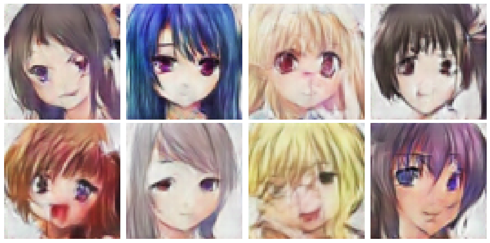

## Anime Faces Generator with GAN using PyTorch
[Notebook on Kaggle](https://www.kaggle.com/code/soroushesnaashari/anime-faces-generator-gan-using-pytorch)

### Overview

This project implements a Deep Convolutional Generative Adversarial Network (DCGAN) in PyTorch to generate synthetic anime-style faces. We leverage a large dataset of cropped anime headshots, train both a **Generator** and **Discriminator** network from scratch, and visualize the evolution of generated samples over the course of training. The goal is to explore how adversarial training can learn the complex distributions of anime faces and produce high-quality, novel images.

 

### Project Flow

1. **Setup & Imports**  
   - Install and import required libraries (PyTorch, torchvision, matplotlib, etc.).  
   - Set up device configuration (GPU/CPU) and random seeds for reproducibility.

2. **Data Preparation**  
   - **Dataset Download & Organization**: Point to a directory of anime face images.  
   - **Inspect & Plot Image Sizes**: Analyze original resolutions to choose a target size.  
   - **Preprocessing Pipeline**: Resize, center-crop, convert to Tensor, and normalize images to \[-1, 1\].  
   - **DataLoader**: Wrap the preprocessed dataset in a `DataLoader` for efficient batch iteration.

3. **Model Definition**  
   - **Generator** (`class Generator`):  
     - Takes a latent noise vector (100‑dim) and applies a series of `ConvTranspose2d` + BatchNorm + ReLU layers.  
     - Upsamples to a final 3×64×64 image with a `Tanh` activation.  
   - **Discriminator** (`class Discriminator`):  
     - Takes a 3×64×64 image and applies downsampling via `Conv2d` + BatchNorm + LeakyReLU.  
     - Flattens the output and applies a `Sigmoid` to predict real/fake.

4. **Training Setup**  
   - **Loss & Optimizers**:  
     - Binary Cross‑Entropy loss for both networks.  
     - Adam optimizer with learning rate = 0.0002, betas = (0.5, 0.999).  
   - **Training Step**:  
     - **Discriminator update**: Maximize log D(x) + log (1 – D(G(z))).  
     - **Generator update**: Minimize log (1 – D(G(z))) (or equivalently maximize log D(G(z))).  
   - **Utilities**:  
     - Fixed “seed” noise for consistent sample visualization.  
     - Functions to save model checkpoints every 5 epochs.

5. **Training Loop**  
   - Run for 50 epochs over the dataset.  
   - For each epoch:  
     - Loop over batches, compute and accumulate generator & discriminator losses.  
     - Every 5 epochs, save `netG` and `netD` state dictionaries to `./checkpoints/`.  
     - Generate a grid of sample images from the fixed seed and save to `./epoch_images_torch/`.  
     - Display the sample grid and print epoch‑wise loss averages.

6. **Visualization & Results**  
   - View saved epoch images to monitor how sample quality improves over time.  
   - (Optionally) Plot loss curves to inspect convergence behavior.

 

### Key Features

- **DCGAN Architecture**  
  - Standard DCGAN blocks: ConvTranspose2d for upsampling in the Generator; Conv2d for downsampling in the Discriminator.  
  - BatchNorm and LeakyReLU/ReLU activations for stable training.

- **Configurable Hyperparameters**  
  - **Latent dimension** (`latent_dim`): Size of noise vector (default 100).  
  - **Feature map sizes** (`ngf`, `ndf`): Number of channels in Generator/Discriminator layers.  
  - **Image size**: Adjustable target resolution (default 64×64).

- **Data Augmentation & Normalization**  
  - Center cropping, resizing, tensor conversion, and normalization to \[-1, 1\] for faster convergence.

- **Checkpointing & Logging**  
  - Saves generator/discriminator weights every 5 epochs.  
  - Fixed-noise sample images saved per epoch for consistent visual tracking.

- **Device Agnostic**  
  - Automatically uses GPU when available, falling back to CPU otherwise.

 

### Results

After 50 epochs of training on a diverse anime-face dataset:

- **Visual Quality**  
  - Early epochs (1–10): Coarse, noisy face-like blobs.  
  - Mid epochs (20–30): Emergence of facial structures (eyes, hair outlines).  
  - Late epochs (40–50): Sharp, realistic-looking anime faces with distinct features.

- **Loss Behavior**  
  - Generator and Discriminator losses fluctuate but generally stabilize as they reach the Nash equilibrium.  
  - Typical final losses (approx.):  
    - Generator loss ≈ 0.45  
    - Discriminator loss ≈ 0.55  

- **Artifacts & Improvements**  
  - Some symmetry artifacts at intermediate epochs.  
  - Further training or architectural tweaks (e.g., spectral normalization, deeper networks) can reduce artifacts and improve diversity.

- **Fresh Image**

 

### Repository Contents
- **`anime-faces-generator-gan-using-pytorch.ipynb`**: Jupyter Notebook with full code, visualizations and explanations.
- **`Data`:** Contains the [Original Dataset](https://www.kaggle.com/datasets/splcher/animefacedataset) and you can see the cleaned dataset in notebook.
- **`README.md`:** Project documentation.

 

### How to Contribute
Contributions are welcome! If you'd like to improve the project or add new features:

1. **Fork the repository.**
2. **Create a new branch.**
3. **Make your changes and submit a pull request.**

